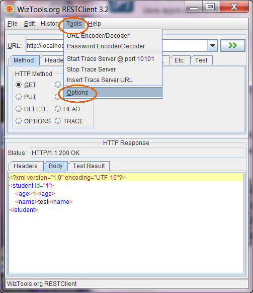
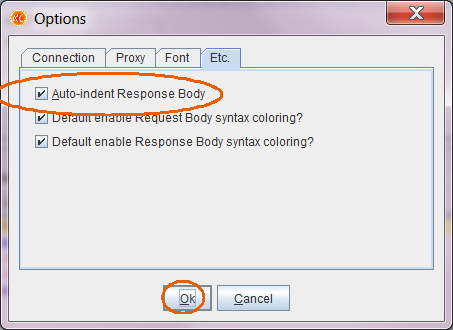
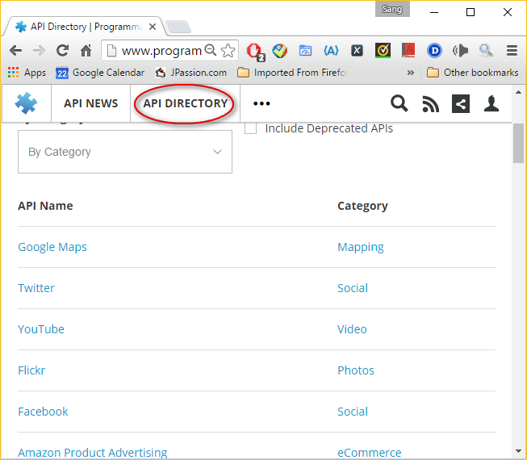
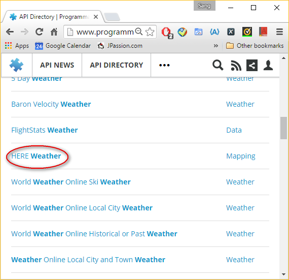
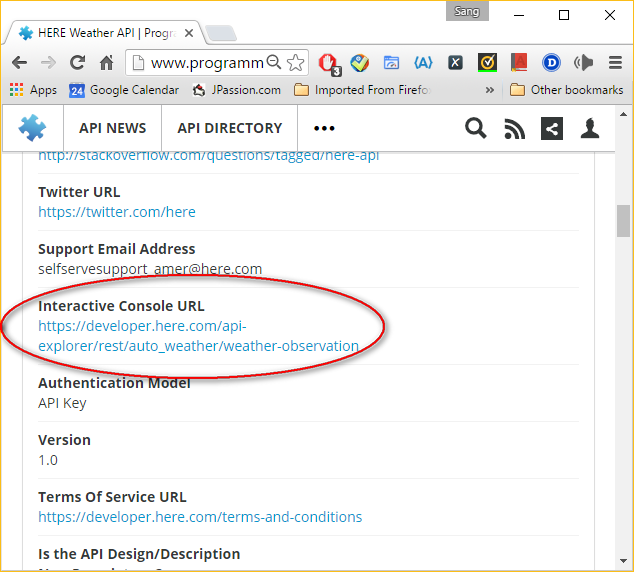
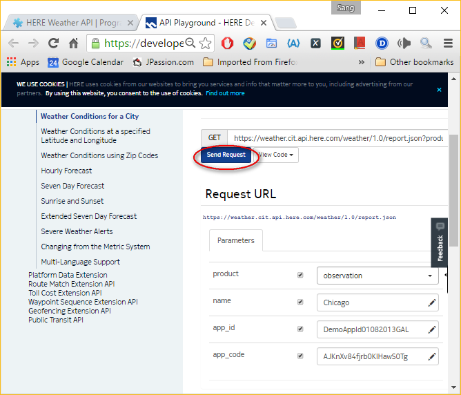
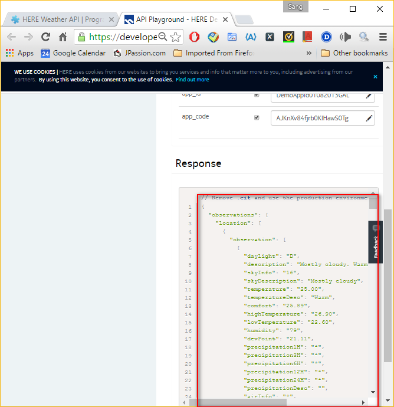

# Worksheet on REST and Java

In this worksheet, you are going to install the REST client tools you are going to
use for this exercise, and you will explore some example RESTful services available on the net.

**Expected duration: 30 minutes (excluding optional exercises)**

## Exercise 1: Install client-side REST tools 

In this exercise, you will download and install REST client tools.  You can install either Postman or RestClient.


1.  Download and install \"curl\"
2.  Install the Postman Chrome plugin (or a desktop version of it)
3.  Install \"RestClient\"

### 1.1 Download \"curl\" ([only for systems which do not have it already])

 [For Mac OS misc.X or other Linux systems, the "Curl\" utility comes with the OS.  Re-installation of \"Curl\" might cause malfunctioning behaviour on Mac OS misc.X or other Linux systems.

1. Check if curl is already installed on your system
   In a Terminal or console, type

   ```shell
   curl
   ```

   

2. Using your browser, go to <http://curl.haxx.se/>.

   + Download the latest stable binary and library corresponding to your system
   + Install them on your machine

### 1.2 Install \"Postman\" Chrome plug-in or the Desktop version

### 1.3 Download and install \"RestClient\"

1. Using your browser, go to
   <http://jpassion.com/downloads/restclient-ui-3.2.2-jar-with-dependencies.jar> 
   and download it.

2. Run it using the following command. (Or you can double-click the `restclient-ui-3.2-jar-with-dependencies.jar` within the file system explorer of your OS.)

   ```shell
   java -jar restclient-ui-3.2-jar-with-dependencies.jar
   ```

   3. You can set the \"Auto-indent Response Body\" option to see XML/JSON
      responses in properly indented format.  (Otherwise, the XML/JSON
      response will be a single-line format, which would be hard to read.)

      {width="503" height="582"}
      \
      {width="453" height="330"}\
      \

   

## Exercise 2: Explore REST APIs 

In this exercise, you are going to explore some REST APIs that are available on the net.

1.  Explore Google Map API
2.  Explore Weather API

### 2.1 Explore Google Map API 

1. Using your browser, go to <http://maps.googleapis.com/maps/api/geocode/json?address=chicago>
   XXX

2. Then try a different city <http://maps.googleapis.com/maps/api/geocode/json?address=newyork>

   XXX

3. Then try XML response <http://maps.googleapis.com/maps/api/geocode/xml?address=newyork>
   XXX

4. Then try it with \"curl\"

   XXX

### 2.2 Explore Weather API 

1. Go to <http://www.programmableweb.com/>

2. Select an API directory
   

   {width="653" height="570"}\

3. Select a weather category
   

   {width="570" height="551"}

   {width="570" height="551"}

   {width="634" height="572"}

   {width="668" height="572"}

   {width="668" height="690"}
   
